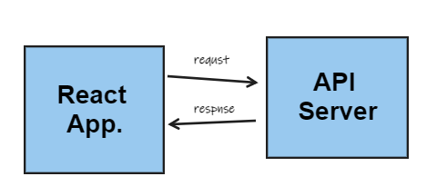
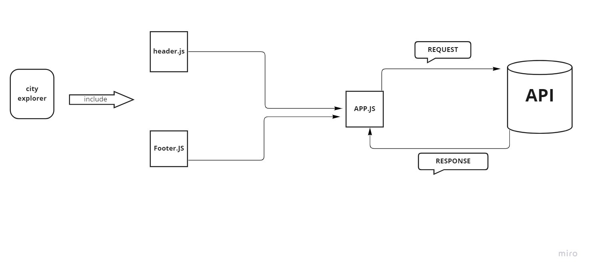

# city-explorer0

**Author**: Noor Alkhateeb
**Version**: 1.0.0

## Overview
City Explorer, can you enter the name of a location so that you can see the exact latitude and longitude of that location, And you can see a map of the city so that you can see the layout of the area you want to explore.

## Getting Started
1. setup a new React application named `city-explorer` in your local projects directory. 
2. Connect your GitHub repo to your local repo using the directions on GitHub.
3. Create a PR of your basic React app to your `main` branch.
4. Procure a LocationIQ free-tier account. From the Dashboard, navigate to your API Access Tokens page. View, then Update the existing token, to change the label to "City Explorer".
5. Structure your components.
6. Build a form to collect a city name from the user. Give the submit button the text of "Explore!".
7. Use the data from the form to query LocationIQ for the latitude and longitude of the requested city. 
8. Update the page with the returned `display_name`, `latitude`, and `longitude`, displayed nicely in an appropriate Bootstrap component. 
9. Style your web application.

## Architecture
  * ReactJS 
  * Bootstrap library
  * Axios library 
  * LocationIQ API
  * Netlify

## Changing Log
29-08-2022 4:59pm - Application now has a fully-functional express server, with a GET route for the location resource.

## data flow

## Credit and Collaborations
My colleague [Razan Abdullah](https://github.com/Razan-abdullah),We Draw the web request-response cycle We designed the working methodology and flow of data.